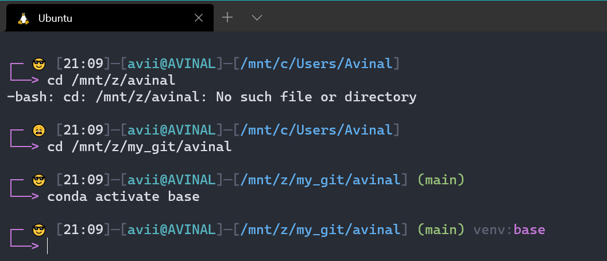
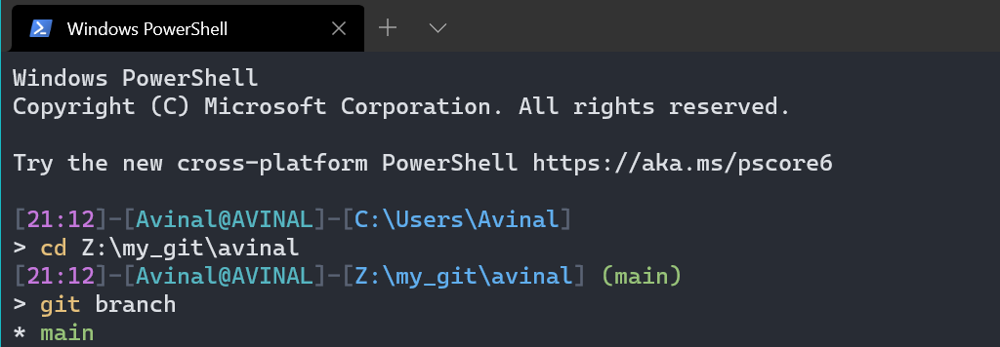

# Dev-Configs
My custom configuration scripts.

1. Customise your Bash Prompt

    

    - To apply this theme open your bash config
    ```bash
    nano ~/.bashrc
    # you may use any text editor e.g - vim
    vim ~/.bashrc
    ```
    - Copy the contents of [custom_prompt.sh](custom_prompt.sh) to the end of `.bashrc`.
    - Save config file and exit
    ```bash
    # for nano 
    Ctrl + O 
    Enter
    Ctrl + X
    # for vim
    :w
    :q
    ```
    - Relaunch terminal or run following command
    ```bash
    source ~/.bashrc
    ```
    - You can change colors and add others options too, currently it shows *time*, *user@host*, *current directory*, *active git branch*,*conda virtual environment* and cute little emojis showing the success of last command. (😎:😩), Some terminals may not support emojis, replace with :) and :( in that case


2. Customise your PowerShell prompt

    

    - Set script execution policy, open a powershell with admin
    ```powershell
    Set-ExecutionPolicy -ExecutionPolicy RemoteSigned -Force
    ```
    - To apply this prompt you first need to find if there is an existing configuration
    ```powershell
    if (!(Test-Path -Path $PROFILE)){ New-Item -Path $PROFILE -ItemType File } ; notepad $PROFILE
    ```
    - Copy the contents of [profile.ps1](powershell/profile.ps1) to this file, save and exit
    - Relaunch your powershell